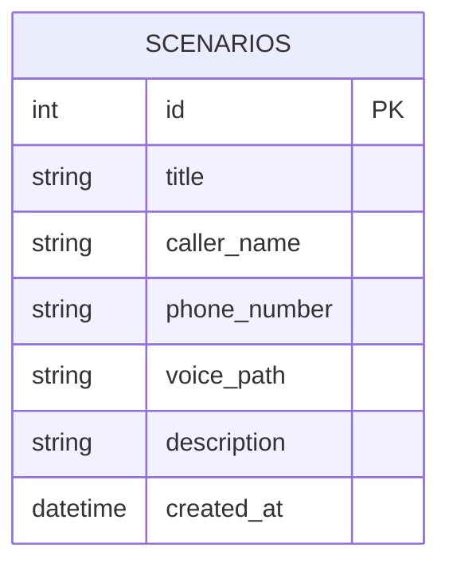

# 資料庫設計 (DB Design)

## 1. ER 圖（實體關係圖）


## 2. 資料表詳細說明
### SCENARIOS
儲存系統預設或使用者自訂的脫逃劇本。
- `id` (INTEGER): 主鍵
- `title` (TEXT): 劇本名稱（例：家庭急事、公司加班）
- `caller_name` (TEXT): 模擬的來電名稱（例：媽媽、老闆）
- `phone_number` (TEXT): 模擬的來電號碼
- `voice_path` (TEXT): 對應的預錄語音路徑
- `description` (TEXT): 情境說明
- `created_at` (DATETIME): 建立時間

## 3. SQL 建表語法
存放於 `database/schema.sql`。
```sql
CREATE TABLE IF NOT EXISTS scenarios (
    id INTEGER PRIMARY KEY AUTOINCREMENT,
    title TEXT NOT NULL,
    caller_name TEXT NOT NULL,
    phone_number TEXT NOT NULL,
    voice_path TEXT,
    description TEXT,
    created_at DATETIME DEFAULT CURRENT_TIMESTAMP
);
```
