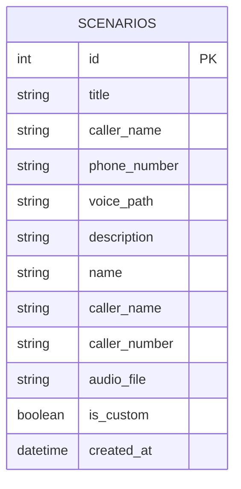

# 資料庫設計 (DB Design)

## 1. ER 圖 (實體關係圖)

專案目前不具備帳號登入系統，所有資料將儲存於 SQLite 中作為全域的情境範本供選用。我們設計一個 `scenarios` (情境劇本) 資料表。

## 2. 資料表詳細說明

### `scenarios` 資料表

用來儲存假來電的情境劇本。

| 欄位名稱 | 型別 | 必填 | 說明 |
| :--- | :--- | :--- | :--- |
| `id` | INTEGER | 是 | Primary Key, 自動遞增 |
| `name` | TEXT | 是 | 情境名稱 (例如：「媽媽催回家」) |
| `caller_name` | TEXT | 是 | 顯示的來電者名稱 (例如：「媽媽」) |
| `caller_number` | TEXT | 否 | 顯示的來電號碼 (例如：「0912-345-678」) |
| `audio_file` | TEXT | 否 | 對應的語音檔案路徑 (例如：「mom_call.mp3」) |
| `is_custom` | BOOLEAN | 是 | 是否為使用者自定義 (1: 是, 0: 預設內建) |
| `created_at` | DATETIME | 是 | 建立時間 |

## 3. SQL 建表語法

請參考 `database/schema.sql` 檔案。

## 4. Python Model 程式碼

請參考 `app/models/scenario.py` 檔案。
