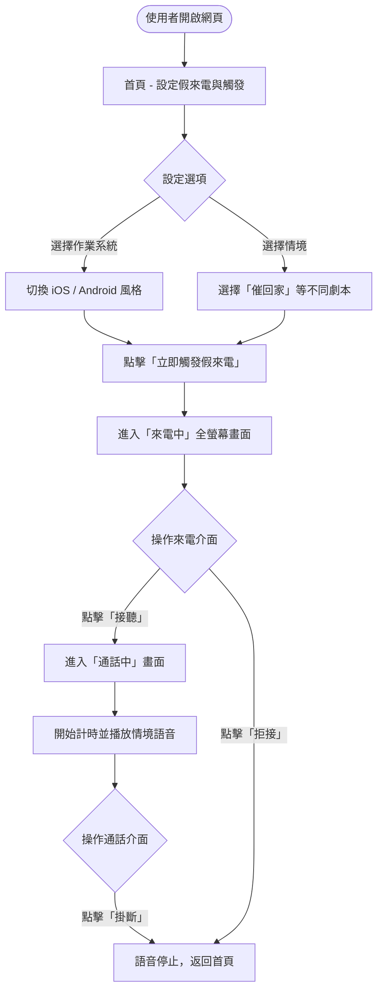
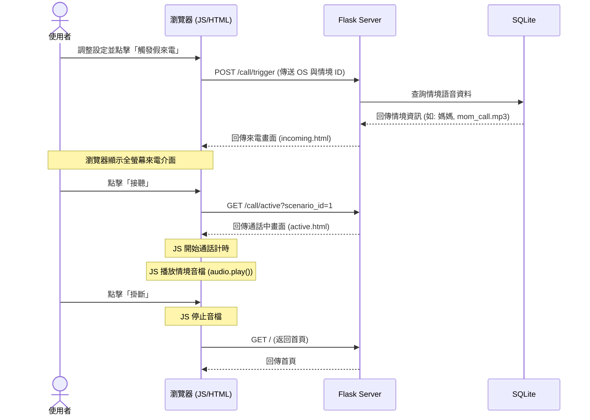

# 流程圖設計 (Flowcharts)

## 1. 使用者流程圖 (User Flow)

此流程圖描述使用者從進入系統到完成「假來電脫逃」的完整操作路徑。

## 2. 系統順序圖 (Sequence Diagram)

此圖描述點擊「觸發假來電」到接聽播放語音的系統資料流。

## 3. 功能清單對照表

| 功能 | HTTP 方法 | URL 路徑 | 說明 |
| :--- | :--- | :--- | :--- |
| 首頁 (設定) | GET | `/` | 顯示表單讓使用者選擇介面風格與語音劇本 |
| 觸發假來電 | POST | `/call/trigger` | 接收表單設定，跳轉到來電中畫面 |
| 來電中畫面 | GET | `/call/incoming` | 顯示來電響鈴介面，提供接聽與拒接按鈕 |
| 通話中畫面 | GET | `/call/active` | 顯示通話中介面，開始計時並播放對應語音 |
