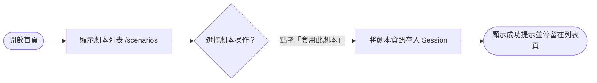
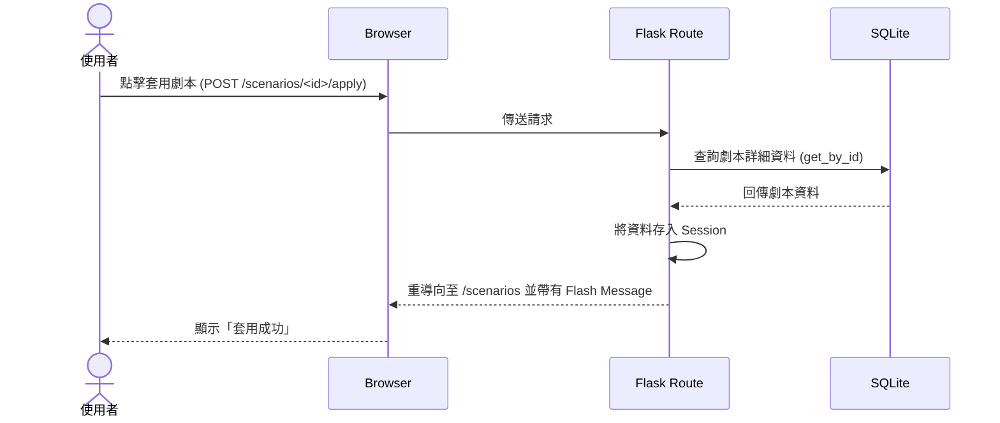

# 使用者與系統流程圖 (Flowchart)

## 1. 使用者流程圖（User Flow）

## 2. 系統序列圖（Sequence Diagram）

## 3. 功能清單對照表
| 功能 | HTTP 方法 | URL 路徑 | 對應模板 | 說明 |
|---|---|---|---|---|
| 顯示劇本列表 | GET | `/scenarios/` | `scenario/index.html` | 讀取所有預設劇本並展示 |
| 套用指定劇本 | POST | `/scenarios/<id>/apply` | — | 將選中的劇本資訊寫入 session |
